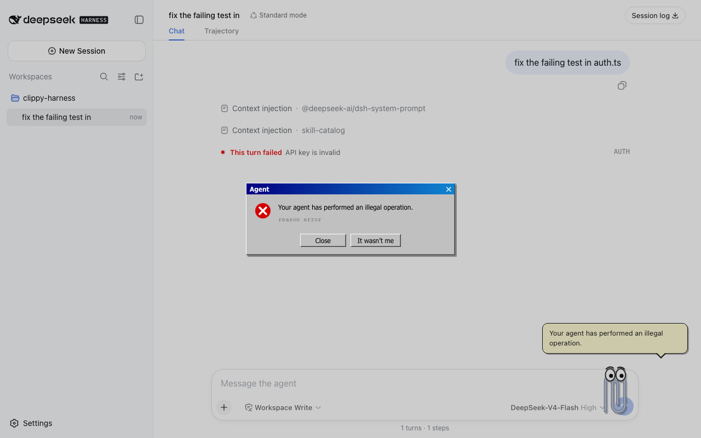

# 📎 Clippy Harness

> "It looks like you're writing code. **This time I can actually help.**"

An office assistant pet for the [DeepSeek Harness](https://github.com/deepseek-ai/deepseek-harness) Web UI.

He watched you write documents for 25 years and could do nothing.
Now he has an agent runtime.


## What he does

- **Reacts to real agent state**, straight from core session events. Thinking, running tools (with the tool name), done, failed.
- **Celebrates when the turn actually completes.** He checked. Twice.
- **Opens a classic dialog when a turn fails.** *"Your agent has performed an illegal operation."* Buttons are Close and It wasn't me.
- Drag him anywhere. Hide him and a summon button appears. He is good at waiting. 25 years of practice.



## Install

```sh
npx @deepseek-ai/dsh plugin --profile web add dsh-clippy
```

Then restart `dsh web` and he is in the corner.

From a checkout

```sh
npx @deepseek-ai/dsh plugin --profile web add link:/path/to/clippy-harness/plugin
```

## States

| Agent state | Clippy | Line |
| --- | --- | --- |
| idle | gentle bob | "It looks like you're writing code. This time I can actually help." |
| thinking | head tilt | "Hmm. Reading your codebase. All of it. Unlike 1997." |
| running a tool | busy bounce | "Running tools. Real exit codes only." |
| done | jump | "That actually worked. I checked. Twice." |
| failed | shake + dialog | "Your agent has performed an illegal operation." |

## Pairs well with

The `xp` skin from [dsh-skins](https://github.com/zhu1090093659/dsh-web-ui) turns the whole Web UI into a retro desktop. Clippy fits right in. He works on the default theme too.

## Why

Every AI assistant today is trying to look like the future.
The first one of them all deserves to come back and see how it turned out.

---

<details>
<summary>中文</summary>

回形针助手回来了，这次它真的会干活。

为 DeepSeek Harness Web UI 打造的办公助手宠物。

- 直接订阅核心会话事件，对真实智能体状态做出反应，包括思考、执行工具（显示工具名）、完成、报错
- 任务真正完成时跳起来庆祝
- 回合失败时弹出经典对话框 *"Your agent has performed an illegal operation."*
- 可拖动、可隐藏，搭配 dsh-skins 的 xp 皮肤即是完整复古桌面

安装

```sh
npx @deepseek-ai/dsh plugin --profile web add dsh-clippy
```

</details>

## License

MIT. Not affiliated with Microsoft. The paperclip is an original drawing. Clippit, we miss you.
