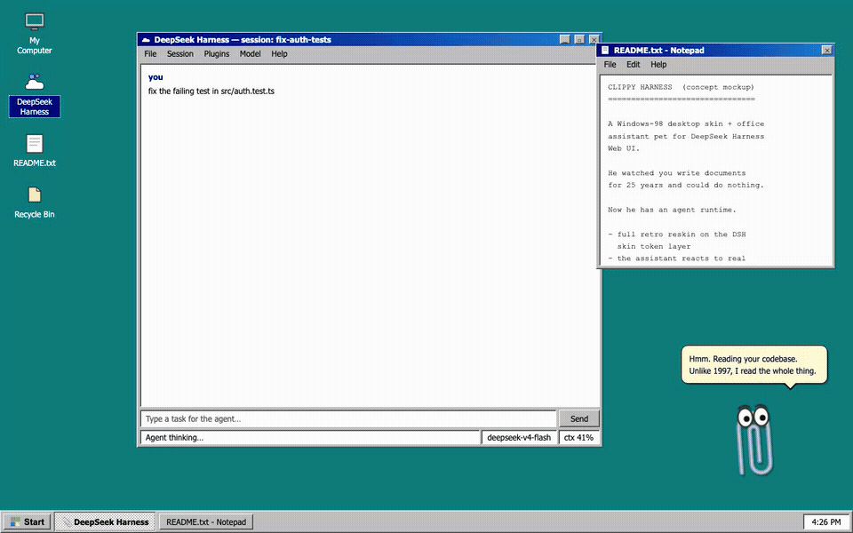

# 📎 Clippy Harness

> "It looks like you're writing code. **This time I can actually help.**"

An office assistant pet for the [DeepSeek Harness](https://github.com/deepseek-ai/deepseek-harness) Web UI.

He watched you write documents for 25 years and could do nothing.
Now he has an agent runtime.

## What it is

- **An assistant that reacts to real agent state.** Idle, thinking, running tools, done, error. He bounces when your tests actually pass. He checked. Twice.
- **Classic dialogs.** When a session crashes he tells you *"Your agent has performed an illegal operation."*
- **Composes with skins.** Pair it with the `xp` skin from dsh-skins for the full retro desktop, like the GIF above. Works on the default theme too.
- One npm install.

## Status

**Concept stage, building this week.** The GIF above is a working mockup. [Open it in your browser](demo/mockup.html).

Star the repo to follow along, or tell me what the error dialog should say in the issues.

## Why

Every AI assistant today is trying to look like the future.
The first one of them all deserves to come back and see how it turned out.

---

中文

回形针助手回来了，这次它真的会干活。

为 DeepSeek Harness Web UI 打造的办公助手宠物。

- 助手对真实智能体状态做出反应，包括思考、执行工具、完成、报错
- 会话崩溃时弹出经典对话框 *"Your agent has performed an illegal operation."*
- 搭配 dsh-skins 的 xp 皮肤即是完整复古桌面

目前为概念阶段，本周开工。欢迎 Star 关注进展。

## License

MIT. Not affiliated with Microsoft. The paperclip is an original drawing. Clippit, we miss you.
