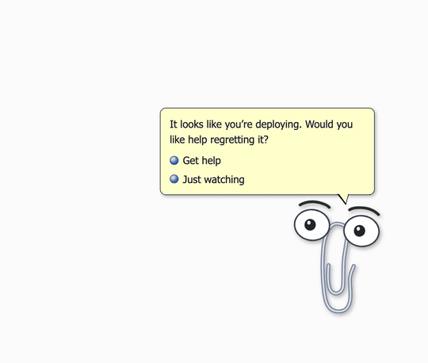

# 📎 Clippy Harness

[](https://www.npmjs.com/package/dsh-clippy)
[](LICENSE)

[English](README.md) | 中文

> "It looks like you're writing code. **This time I can actually help.**"

为 [DeepSeek Harness](https://github.com/deepseek-ai/deepseek-harness) Web UI 打造的办公助手宠物。

他看了你 25 年的文档，什么忙也帮不上。
现在他有了智能体运行时。


## 安装

```sh
npx @deepseek-ai/dsh plugin --profile web add dsh-clippy
```

重启 `dsh web`，他就在角落里了。

## 他又开始插嘴了

经典回归。他会读你发给智能体的消息，觉得有风险就要发表意见。输入 "deploy" 就会弹出选项。每条规则一个会话只触发一次，之后他就不管了。



## 他跟随真实的智能体状态

订阅核心会话事件，每个反应都来自智能体的真实状态。

| 思考中 | 执行工具 |
| --- | --- |
|  |  |

| 回合完成 | 回合失败 |
| --- | --- |
|  |  |

- 思考时歪头，执行工具时忙碌地跳动
- 回合真正完成时跳起来庆祝
- 回合失败时眉毛竖起来，弹出经典对话框 *"Your agent has performed an illegal operation."*

## 他现在有性格了

- 空闲时会眨眼、东张西望、扭一扭
- 点他有反应，可以拖到任何位置
- 右键打开菜单。隐藏、声音开关、关于 Clippy、再解雇他一次
- 可选的合成复古音效（默认关闭，不携带任何音频文件）

## 自定义台词

所有台词都可以通过插件配置替换。

```yaml
- id: clippy
  name: 'dsh-clippy'
  config:
    state:
      lines:
        done:
          - 'Ship it.'
```

## 搭配

配合 [dsh-skins](https://github.com/zhu1090093659/dsh-web-ui) 的 `xp` 皮肤，整个 Web UI 变成完整的复古桌面。

## 致谢

角色绑定改编自 [ManzDev/twitch-clippy](https://github.com/ManzDev/twitch-clippy)（ISC）。

## 许可

MIT。与微软无关。Clippit，我们想你。
