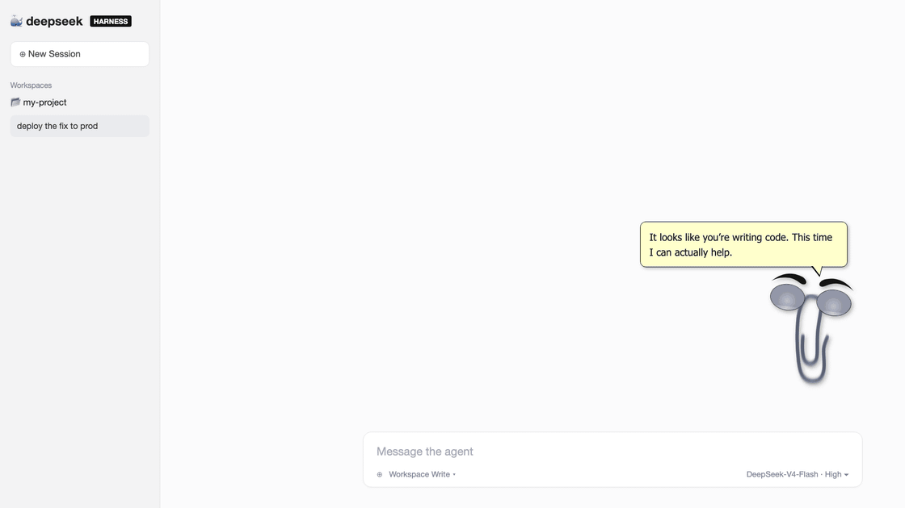
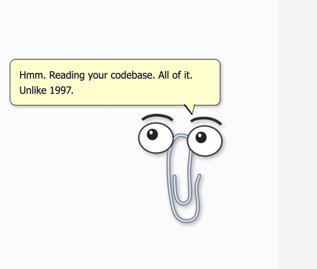
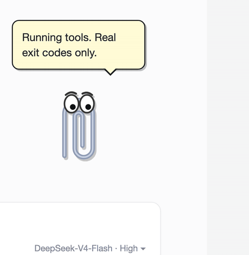
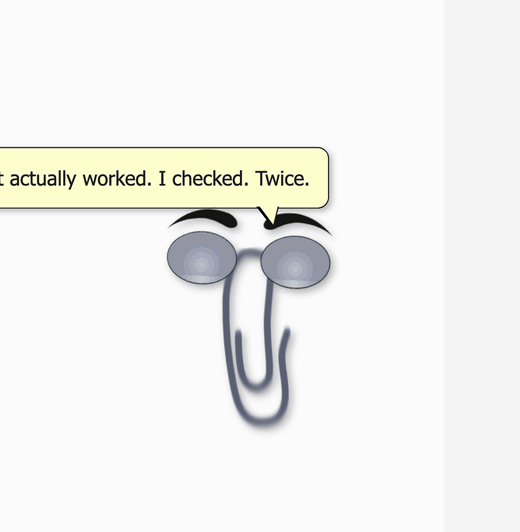
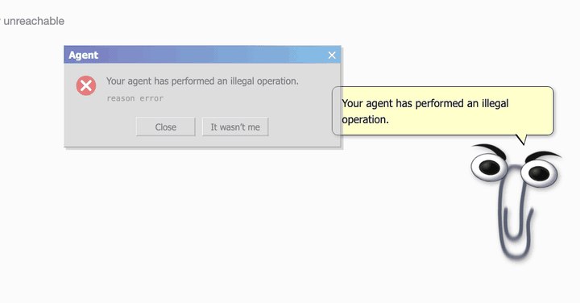

# 📎 Clippy Harness

[](https://www.npmjs.com/package/dsh-clippy)
[](LICENSE)

[English](README.md) | 中文

> "It looks like you're writing code. **This time I can actually help.**"

为 [DeepSeek Harness](https://github.com/deepseek-ai/deepseek-harness) Web UI 打造的办公助手宠物。

他看了你 25 年的文档，什么忙也帮不上。
现在他有了智能体运行时。



## 安装

```sh
npx @deepseek-ai/dsh plugin --profile web add dsh-clippy
```

重启 `dsh web`，他就在角落里了。

## 他会做什么

订阅核心会话事件，每个反应都来自智能体的真实状态，不是贴图。

| 思考中 | 执行工具 |
| --- | --- |
|  |  |

| 回合完成 | 回合失败 |
| --- | --- |
|  |  |

- **思考时**歪头。他现在真的会读你的代码库了，和 1997 年不一样
- **执行工具时**忙碌地跳动，气泡里显示工具名
- **回合真正完成时**跳起来庆祝
- **回合失败时**弹出经典对话框 *"Your agent has performed an illegal operation."*，按钮是 Close 和 It wasn't me
- 可拖动，可隐藏，隐藏后出现召唤按钮。他很擅长等待，练了 25 年

## 搭配

配合 [dsh-skins](https://github.com/zhu1090093659/dsh-web-ui) 的 `xp` 皮肤，整个 Web UI 变成完整的复古桌面。默认主题下也能用。

## 许可

MIT。与微软无关，回形针是原创绘制。Clippit，我们想你。
